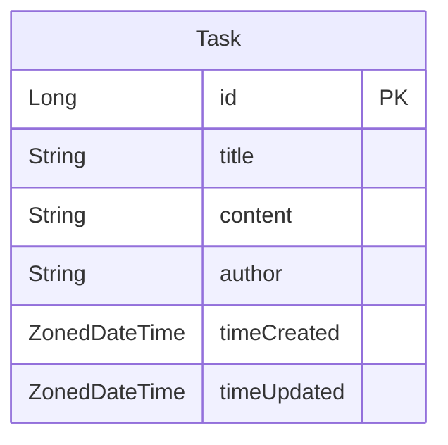

<p align = "center">
    
    
</p>

# T o d o S e r v e r

# 개발 환경

| 기준  | 내용                                                                                                   |
|-----|------------------------------------------------------------------------------------------------------|
| OS  | `Arch Linux x86_64 w/ Linux 6.6.32-1-lts`                                                            |
| IDE | `IntelliJ IDEA 2024.1.2`                                                                             |
| SDK | 개발 언어: `Kotlin 1.9.24`(JVM: `OpenJDK 17.0.11`)<br/>프레임워크: `Spring Boot 3.3.0`<br/>빌드 툴: `Gradle 8.8` |

# 목차
<!-- TOC -->
* [1. 과제 요구사항](#1-과제-요구사항)
* [2. 고민거리(과제 제출 시 같이 써야 하는 질문들)](#2-고민거리과제-제출-시-같이-써야-하는-질문들)
* [3. 데이터베이스](#3-데이터베이스)
    * [3-1. Entity Relationship Diagram (ERD)](#3-1-entity-relationship-diagram-erd)
    * [3-2. 데이터베이스 테이블](#3-2-데이터베이스-테이블)
* [4. API 명세서](#4-api-명세서)
    * [4-1. API call](#4-1-api-call)
    * [4-2. API Call에 이용하는 Data Transfer Object (`DTO`)](#4-2-api-call에-이용하는-data-transfer-object-dto)
<!-- TOC -->

# 1. 과제 요구사항

<details> <summary>1-1. Step 1 (필수)</summary>

- [x] 할 일 카드 작성
  - `제목`, `내용`, `작성일`, `작성자` 저장
  - 저장 성공 시 할 일 정보 반환
- [x] 선택한 할 일 조회
  - 선택한 할 일의 정보(`제목`, `내용`, `작성일`, `작성자`) 조회
- [x] 할 일 카드 목록 조회
  - 등록된 *전체* 할 일 조회
  - *작성일 기준 내림차순* 정렬
- [x] 선택한 할 일 수정
  - `작성일`을 제외한 나머지 정보 수정 가능
  - 수정 성공 시 수정된 할 일 정보 반환
- [x] 선택한 할 일 삭제
  - 선택한 할 일 삭제

</details>


# 2. 고민거리(과제 제출 시 같이 써야 하는 질문들)
TBD


# 3. 데이터베이스

## 3-1. Entity Relationship Diagram (ERD)



# 4. API 명세서

## 4-1. API call

- 4-1-1. 할 일(`task`) 관련

| Feature     |   Method | URL                              | Request                   | Response             |
|-------------|---------:|----------------------------------|---------------------------|----------------------|
| 할 일 추가      |   `POST` | `/api/tasks`                     | body: `CreateTaskRequest` | `TaskResponse`       |
| 할 일 조회 (목록) |    `GET` | `/api/tasks`                     | -                         | `List<TaskResponse>` |
| 할 일 조회      |    `GET` | `/api/tasks/{taskId}`            | -                         | `TaskResponse`       |
| 할 일 수정      |    `PUT` | `/api/tasks/{taskId}`            | body: `UpdateTaskRequest` | `TaskResponse`       |
| 할 일 삭제      | `DELETE` | `/api/tasks/{taskId}`            | -                         | -                    |


## 4-2. API Call에 이용하는 Data Transfer Object (`DTO`)

<details> <summary>4-2-1. 요청(request)</summary>
<details> <summary>4-2-1-1. 할 일(`task`) 관련</summary>

- 4-2-1-1-1. `CreateTaskRequest`

할 일 추가 시(`POST /api/tasks`) `body`에 추가하는 내용
```kotlin
data class CreateTaskRequest(
    val title: String,          // 추가할 할 일의 제목
    val content: String,        // 추가할 할 일의 본문
    val owner: String           // 추가할 할 일의 소유자
)
```

- 4-2-1-1-2. `UpdateTaskRequest`

할 일 수정 시(`PATCH /api/tasks`) `body`에 추가하는 내용
```kotlin
data class UpdateTaskRequest(
    val title: String,          // 수정할 할 일의 제목
    val content: String,        // 수정할 할 일의 본문
    val owner: String           // 수정할 할 일의 소유자
)
```
</details>
</details>

<details> <summary>4-2-2. 응답(response)</summary>
<details> <summary>4-2-2-1. 할 일(`task`) 관련</summary>

- 4-2-2-1-1. `TaskResponse`

할 일(`task`)에 대해 CRU~~D~~ 진행 시 서버에서 보내는 응답
```kotlin
import java.time.ZonedDateTime

data class TaskResponse(
    val id: Long?,                      // 할 일의 ID
    val title: String,                  // 할 일의 제목
    val content: String,                // 할 일의 본문
    val owner: String,                  // 할 일의 소유자
    val createdAt: ZonedDateTime,       // 할 일의 생성 시각
    val updatedAt: ZonedDateTime        // 할 일의 마지막 수정 시각
)
```

</details>
</details>